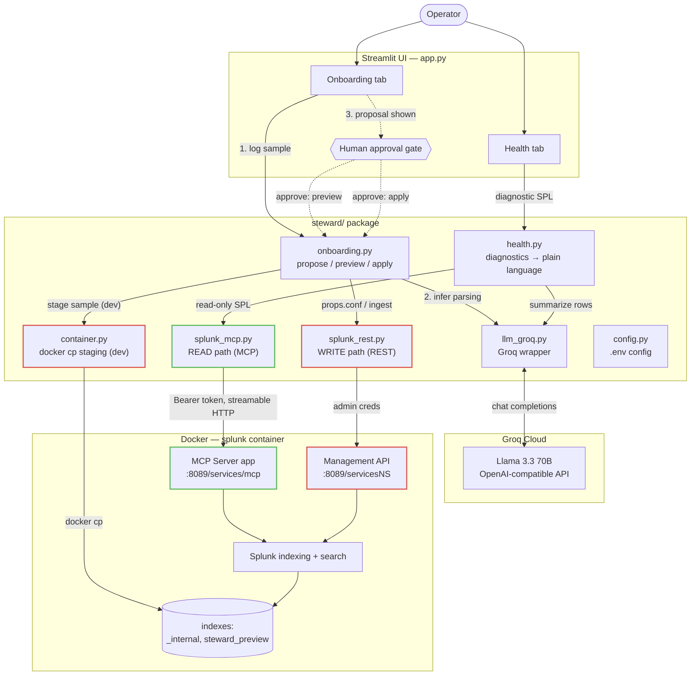

# Splunk Steward — Architecture

Steward is an AI operations copilot for Splunk. It pairs a **read path** (query
Splunk safely through the MCP Server) with a **reasoning engine** (Groq LLM) and a
**write path** (apply config via the REST API) — with every side effect gated behind
explicit human approval in the UI.

## System diagram



Legend: **green** = read path (MCP, never mutates Splunk) · **red** = write path
(REST + container staging, only reached after human approval).

## Two paths, by design

| | Read path | Write path |
|---|---|---|
| Module | [`splunk_mcp.py`](steward/splunk_mcp.py) | [`splunk_rest.py`](steward/splunk_rest.py) |
| Transport | MCP Server, streamable HTTP, `:8089/services/mcp` | Management REST API, `:8089/servicesNS` |
| Auth | RSA-encrypted MCP bearer token (`steward` / `mcp_user` role) | Splunk admin credentials (local dev) |
| Mutates Splunk? | **No** — query/inventory only | **Yes** — writes `props.conf`, creates indexes, ingests |
| Gating | Always safe to call | **Only after explicit UI approval** |

Separating reads from writes means the LLM-facing surface (MCP) can never change
Splunk state. All mutations go through `splunk_rest`, which the UI calls only after
the operator approves a shown diff.

## Components

| Module | Responsibility |
|---|---|
| [`config.py`](steward/config.py) | Loads all settings/secrets from `.env`; single source of truth |
| [`llm_groq.py`](steward/llm_groq.py) | Groq wrapper — `complete()` (text) and `complete_json()` (structured) |
| [`splunk_mcp.py`](steward/splunk_mcp.py) | Read path — `run_query`, `get_knowledge_objects`, `ping` via the MCP SDK |
| [`splunk_rest.py`](steward/splunk_rest.py) | Write path — `apply_conf_stanza`, `ensure_index`, `oneshot_ingest` |
| [`container.py`](steward/container.py) | Dev-only — `docker cp` a sample into the Splunk container for preview |
| [`onboarding.py`](steward/onboarding.py) | Core flow — `propose_config` → `preview_ingest` → `apply_proposal` |
| [`health.py`](steward/health.py) | Read-only diagnostics turned into plain-language findings + fixes |
| [`app.py`](app.py) | Streamlit UI — two tabs, approval gates on every side effect |

## The onboarding flow (centerpiece)

```
raw log sample
   → Groq infers props.conf            (propose_config — pure read, no Splunk writes)
   → operator reviews the diff         (UI shows the stanza + rationale + confidence)
   → [approve] preview ingest          (container.stage_file → ensure_index → oneshot)
   → operator verifies parsed events   (runs the returned verify_spl through MCP)
   → [approve] apply config            (splunk_rest writes props.conf to target app)
```

The LLM only ever *proposes*. A human sees the result of the proposal — both the
config diff and a real preview ingest — before anything is applied.

## Trust & safety boundaries

- **LLM cannot mutate Splunk.** Groq sees log samples and search rows; it returns
  text/JSON proposals. It has no path to the write API.
- **Human-in-the-loop by construction.** `apply_proposal` and `preview_ingest` are
  only invoked behind explicit Streamlit buttons that appear after a proposal is shown.
- **Preview is isolated.** Ingests land in a throwaway `steward_preview` index, kept
  separate from production data.
- **Least-privilege reads.** MCP access uses the dedicated `steward` user with the
  `mcp_user` role (`mcp_tool_execute`), not admin.

## Dev-only vs. production

The preview ingest copies the sample into the indexer with `docker cp`
([`container.py`](steward/container.py)) because local Splunk runs in Docker and
reads from the *container* filesystem, not the host. **This is a development
convenience.** A production deployment would onboard data with a Universal Forwarder
or HTTP Event Collector (HEC) rather than copying files onto the indexer, and would
use a proper certificate (Steward disables TLS verification only for the local
self-signed cert, via `SPLUNK_VERIFY_SSL`).

## Configuration

All settings come from `.env` (see [SETUP.md](SETUP.md) and [README.md](README.md)):

| Variable | Purpose |
|---|---|
| `SPLUNK_MCP_URL`, `SPLUNK_MCP_TOKEN` | Read path — MCP endpoint + bearer token |
| `SPLUNK_HOST`, `SPLUNK_MGMT_PORT`, `SPLUNK_ADMIN_PASSWORD` | Write path — REST API |
| `SPLUNK_VERIFY_SSL` | TLS verification (false for local self-signed) |
| `GROQ_API_KEY`, `GROQ_MODEL` | Reasoning engine |
| `STEWARD_TARGET_APP` | Splunk app config is written into |
| `STEWARD_SPLUNK_CONTAINER`, `STEWARD_CONTAINER_DATA_DIR` | Dev preview staging |
